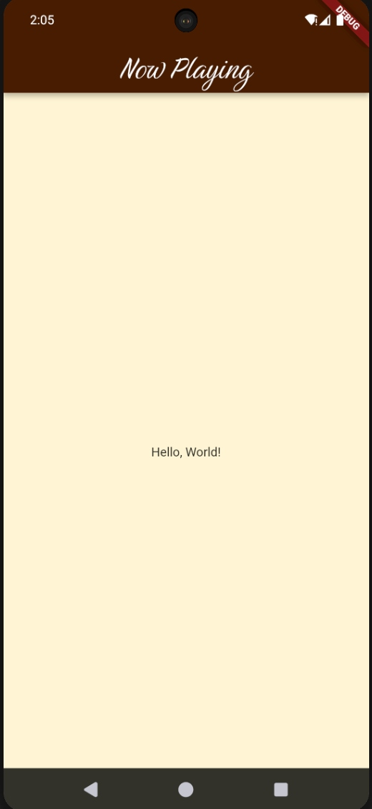

# Flutter Latihan Themed App

Latihan Mata Kuliah Pemrograman Mobile 2 – Membuat Themed App Menggunakan Flutter

## App Preview



## Features

- Custom themed Flutter app using `ThemeData`
- AppBar with "Birthstone" custom font
- Cream background, brown accent color
- Minimalist layout, ready for further development

## Getting Started

To run this project locally:

1. **Clone the repository:**
    ```
    git clone https://github.com/SidqiRaafi/Flutter_Latihan_Themed_App.git
    ```

2. **Navigate into the directory:**
    ```
    cd Flutter_Latihan_Themed_App
    ```

3. **Get the dependencies:**
    ```
    flutter pub get
    ```

4. **Run the app:**
    ```
    flutter run
    ```

### Build a Release APK

To build a release APK, run:
```
flutter build apk --release
```
You will find the APK at `build/app/outputs/flutter-apk/app-release.apk`.

## Credits

- Built for the Mobile Programming 2 course assignment

---

